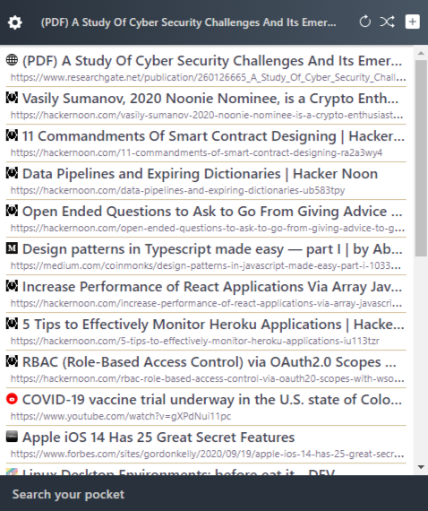

## Pocketer

A user-friendly extension to manage your [Pocket](https://getpocket.com) bookmarks and read later items inside Google Chrome.

 

 

You can download it from [Chrome Web Store](https://chrome.google.com/webstore/detail/in-your-pocket).

### Development

You need to [download](https://nodejs.org) and install `npm` on your machine. Clone the repository and install the dependencies using `npm install`.

* `npm run watch`: Runs the extension in development mode 
* `npm run build`: Creates a production build
* `npm run clean`: Wipes out the distribution folder
* `npm run build`: Perform a clean build
* `npm run pack`: Builds and compresses the archive into a ZIP

### License

[MIT](./LICENSE)